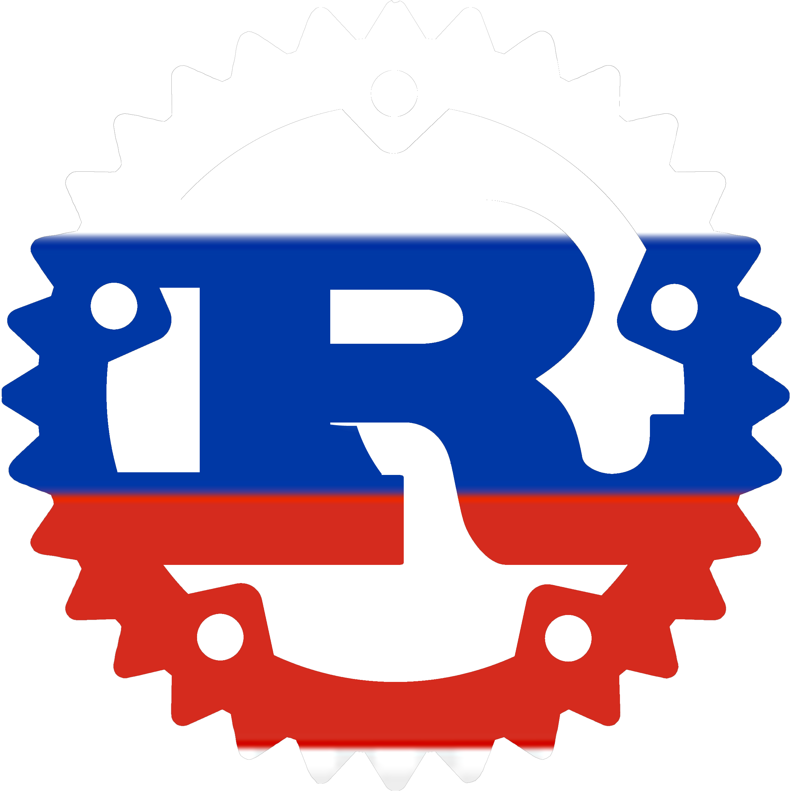

# РЖАВЧИНА

Aren't you _заебался_ from writing Rust programs in English? Do you like saying
"нормалды" and "харош" a lot? Would you like to try something different, in an exotic and
funny-sounding language? Would you want to bring some Russian touch to your
programs?

**rzhavchina** (Russian for _Rust_) is here to save your day, as it allows you to
write Rust programs in Russian, using Russian keywords, Russian function names,
Russian idioms.

This has been designed to be used as the official programming language to
develop the future Russian sovereign operating system.
